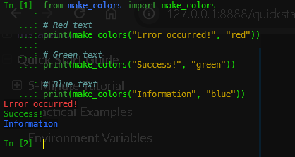

Quick Start Guide
=================

This guide will help you get started with make_colors in just a few minutes.

5-Minute Tutorial
-----------------

Basic Text Coloring
~~~~~~~~~~~~~~~~~~~

The simplest way to add color to your text:

.. code-block:: python

   from make_colors import make_colors
   
   # Red text
   print(make_colors("Error occurred!", "red"))
   
   # Green text
   print(make_colors("Success!", "green"))
   
   # Blue text
   print(make_colors("Information", "blue"))

Output:

Adding Background Colors
~~~~~~~~~~~~~~~~~~~~~~~~~

Use the ``background`` parameter or ``on_`` prefix:

.. code-block:: python

   # Yellow text on black background
   print(make_colors("Warning!", "yellow", "on_black"))
   
   # White text on red background
   print(make_colors("Critical!", "white", "on_red"))
   
   # Black text on yellow background
   print(make_colors("Attention", "black", "on_yellow"))

Using Color Abbreviations
~~~~~~~~~~~~~~~~~~~~~~~~~~

Save time with short color codes:

.. code-block:: python

   # 'r' = red, 'g' = green, 'bl' = blue
   print(make_colors("Quick red", "r"))
   print(make_colors("Quick green", "g"))
   print(make_colors("Quick blue", "bl"))
   
   # Light colors
   print(make_colors("Light blue", "lb"))
   print(make_colors("Light red", "lr"))

Common abbreviations:

- ``r`` / ``rd`` / ``re`` → red
- ``g`` / ``gr`` / ``ge`` → green
- ``bl`` → blue
- ``y`` / ``ye`` / ``yl`` → yellow
- ``m`` / ``mg`` / ``ma`` → magenta
- ``c`` / ``cy`` / ``cn`` → cyan
- ``w`` / ``wh`` → white
- ``b`` / ``bk`` → black
- ``lb``, ``lr``, ``lg``, etc. → light variants

Combined Format
~~~~~~~~~~~~~~~

Specify both colors in one string:

.. code-block:: python

   # Using hyphen separator
   print(make_colors("Text", "red-yellow"))      # Red on yellow
   
   # Using underscore separator
   print(make_colors("Text", "blue_white"))      # Blue on white
   
   # Using comma separator
   print(make_colors("Text", "green,black"))     # Green on black
   
   # With abbreviations
   print(make_colors("Text", "r-y"))             # Red on yellow
   print(make_colors("Text", "lb_b"))            # Light blue on black

Attribute Detection (NEW!)
~~~~~~~~~~~~~~~~~~~~~~~~~~~

Include text attributes directly in the color string:

.. code-block:: python

   # Bold text
   print(make_colors("Bold red", "bold-red"))
   
   # Italic text
   print(make_colors("Italic blue", "italic-blue"))
   
   # Underlined text
   print(make_colors("Underlined green", "underline-green"))
   
   # Multiple attributes
   print(make_colors("Bold italic", "bold-italic-yellow"))
   
   # With background
   print(make_colors("Styled", "bold-white-red"))

Supported attributes:

- ``bold`` - Bold/bright text
- ``dim`` - Dimmed text
- ``italic`` - Italic text (if supported)
- ``underline`` - Underlined text
- ``blink`` - Blinking text
- ``reverse`` - Reverse video
- ``strikethrough`` / ``strike`` - Strikethrough text

Rich Markup Format
~~~~~~~~~~~~~~~~~~

Use intuitive markup syntax:

.. code-block:: python

   # Basic markup
   print(make_colors("[red]Error![/]"))
   print(make_colors("[green]Success![/]"))
   
   # With background
   print(make_colors("[white on red]Alert![/]"))
   print(make_colors("[black on yellow]Warning![/]"))
   
   # With styles
   print(make_colors("[bold red]Critical Error![/]"))
   print(make_colors("[italic blue]Information[/]"))
   print(make_colors("[underline green]Link[/]"))
   
   # Multiple sections
   print(make_colors("[red]Error:[/] [white]Connection failed[/]"))

Convenience Functions
~~~~~~~~~~~~~~~~~~~~~

Use shorter function names:

.. code-block:: python

   from make_colors import make, print
   
   # Short form
   text = make("Hello", "bold-green")
   
   # Direct printing (overrides built-in print)
   print("Success!", "green")
   print("Warning!", "yellow", "on_black")

Magic Functions (Dynamic)
~~~~~~~~~~~~~~~~~~~~~~~~~~

Call color functions directly:

.. code-block:: python

   from make_colors import red, green, blue
   from make_colors import w_bl, r_y, lb_b
   
   # Full names
   print(red("Error message"))
   print(green("Success message"))
   print(blue("Information"))
   
   # Combinations
   print(w_bl("White on blue"))       # white_on_blue
   print(r_y("Red on yellow"))        # red_on_yellow
   print(lb_b("Light blue on black")) # lightblue_on_black

Practical Examples
------------------

Log Levels
~~~~~~~~~~

.. code-block:: python

   from make_colors import make_colors
   
   def log(level, message):
       colors = {
           'DEBUG': ('cyan', None),
           'INFO': ('blue', None),
           'WARNING': ('yellow', 'on_black'),
           'ERROR': ('red', 'on_white'),
           'CRITICAL': ('white', 'on_red')
       }
       fg, bg = colors.get(level, ('white', None))
       level_colored = make_colors(f"[{level}]", fg, bg)
       print(f"{level_colored} {message}")
   
   log('DEBUG', 'Database connection established')
   log('INFO', 'User logged in')
   log('WARNING', 'High memory usage')
   log('ERROR', 'Failed to save file')
   log('CRITICAL', 'System shutdown required')

Status Indicators
~~~~~~~~~~~~~~~~~

.. code-block:: python

   from make_colors import make_colors
   
   def status(state, message):
       symbols = {
           'success': ('✓', 'lightgreen'),
           'warning': ('⚠', 'lightyellow'),
           'error': ('✗', 'lightred'),
           'running': ('●', 'lightblue'),
           'pending': ('◐', 'lightmagenta')
       }
       symbol, color = symbols.get(state, ('?', 'white'))
       print(make_colors(f"{symbol} {message}", color))
   
   status('success', 'All tests passed')
   status('warning', 'Deprecated function used')
   status('error', 'Connection timeout')
   status('running', 'Processing data...')
   status('pending', 'Waiting for response')

Progress Indication
~~~~~~~~~~~~~~~~~~~

.. code-block:: python

   from make_colors import make_colors
   import time
   
   def show_progress(percentage):
       filled = int(percentage / 5)
       bar = '█' * filled + '░' * (20 - filled)
       
       if percentage < 30:
           color = 'red'
       elif percentage < 70:
           color = 'yellow'
       else:
           color = 'green'
       
       return make_colors(f"[{bar}] {percentage}%", color)
   
   # Simulate progress
   for i in range(0, 101, 10):
       print(f"\r{show_progress(i)}", end='', flush=True)
       time.sleep(0.5)
   print()  # New line after completion

Environment Variables
---------------------

Control color behavior globally:

.. code-block:: bash

   # Disable all colors
   export MAKE_COLORS=0
   
   # Force colors (ignore terminal detection)
   export MAKE_COLORS_FORCE=1
   
   # Enable debug output
   export MAKE_COLORS_DEBUG=1

In Python:

.. code-block:: python

   import os
   
   # Disable colors programmatically
   os.environ['MAKE_COLORS'] = '0'
   
   # Or force colors
   os.environ['MAKE_COLORS_FORCE'] = '1'

Next Steps
----------

Now that you know the basics, explore:

- :doc:`usage` - Detailed feature documentation
- :doc:`examples` - More practical examples
- :doc:`rich_markup` - Advanced markup syntax
- :doc:`api/main_functions` - Complete API reference