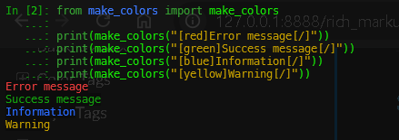

Rich Markup Format
==================

make_colors supports Rich console markup format, providing an intuitive way to style text using inline tags.

Basic Syntax
------------

The general syntax for Rich markup is:

.. code-block:: text

   [style]text[/]

Where ``style`` can be:

- A color name: ``[red]text[/]``
- A color combination: ``[white on blue]text[/]``  
- A style with color: ``[bold red]text[/]``
- A complete style: ``[bold white on blue]text[/]``

Color Tags
----------

Single Color
~~~~~~~~~~~~

Apply a foreground color to text:

.. code-block:: python

   from make_colors import make_colors
   
   print(make_colors("[red]Error message[/]"))
   print(make_colors("[green]Success message[/]"))
   print(make_colors("[blue]Information[/]"))
   print(make_colors("[yellow]Warning[/]"))

**Output:**

Color Combinations
~~~~~~~~~~~~~~~~~~

Specify both foreground and background colors:

.. code-block:: python

   print(make_colors("[white on red]Critical Alert[/]"))
   print(make_colors("[black on yellow]Warning[/]"))
   print(make_colors("[blue on white]Information[/]"))
   print(make_colors("[green on black]Success[/]"))

The ``on`` keyword separates foreground and background colors.

Supported Colors
~~~~~~~~~~~~~~~~

**Standard Colors:**

- ``black``, ``red``, ``green``, ``yellow``
- ``blue``, ``magenta``, ``cyan``, ``white``

**Light Colors:**

- ``lightblack`` / ``lightgrey``
- ``lightred``, ``lightgreen``, ``lightyellow``
- ``lightblue``, ``lightmagenta``, ``lightcyan``, ``lightwhite``

Style Tags
----------

Text Attributes
~~~~~~~~~~~~~~~

Apply text styling attributes:

.. code-block:: python

   print(make_colors("[bold]Bold text[/]"))
   print(make_colors("[italic]Italic text[/]"))
   print(make_colors("[underline]Underlined text[/]"))
   print(make_colors("[dim]Dimmed text[/]"))
   print(make_colors("[strikethrough]Strikethrough text[/]"))
   print(make_colors("[blink]Blinking text[/]"))
   print(make_colors("[reverse]Reverse video[/]"))

Combining Styles with Colors
~~~~~~~~~~~~~~~~~~~~~~~~~~~~~

You can combine text styles with colors:

.. code-block:: python

   # Style + Color
   print(make_colors("[bold red]Bold red text[/]"))
   print(make_colors("[italic blue]Italic blue text[/]"))
   print(make_colors("[underline green]Underlined green[/]"))
   
   # Style + Color + Background
   print(make_colors("[bold white on red]Bold white on red[/]"))
   print(make_colors("[italic black on yellow]Italic warning[/]"))

**Note:** The style keyword must come before color specifications.

Multiple Sections
-----------------

Basic Multiple Tags
~~~~~~~~~~~~~~~~~~~

Use multiple markup sections in a single string:

.. code-block:: python

   text = "[red]Error:[/] [white]File not found[/]"
   print(make_colors(text))
   
   log = "[blue]INFO:[/] [green]Operation completed successfully[/]"
   print(make_colors(log))

Complex Combinations
~~~~~~~~~~~~~~~~~~~~

Create complex, multi-styled messages:

.. code-block:: python

   # Log entry with multiple styles
   log_entry = (
       "[bold white on blue][INFO][/] "
       "[cyan]2024-01-15 10:30:45[/] "
       "[white]User[/] "
       "[yellow]admin[/] "
       "[white]logged in from[/] "
       "[green]192.168.1.100[/]"
   )
   print(make_colors(log_entry))
   
   # Error message with details
   error = (
       "[bold white on red][ERROR][/] "
       "[lightred]Connection failed:[/] "
       "[white]Unable to connect to database at[/] "
       "[cyan]localhost:5432[/]"
   )
   print(make_colors(error))

Practical Examples
------------------

Log Levels
~~~~~~~~~~

.. code-block:: python

   def log_message(level, message):
       templates = {
           'DEBUG': "[bold cyan][DEBUG][/] [white]{message}[/]",
           'INFO': "[bold blue][INFO][/] [white]{message}[/]",
           'SUCCESS': "[bold green][SUCCESS][/] [white]{message}[/]",
           'WARNING': "[bold yellow on black][WARNING][/] [lightyellow]{message}[/]",
           'ERROR': "[bold white on red][ERROR][/] [lightred]{message}[/]",
           'CRITICAL': "[bold white on red][CRITICAL][/] [bold white on red]{message}[/]",
       }
       
       template = templates.get(level, "[white]{message}[/]")
       print(make_colors(template.format(message=message)))
   
   log_message('DEBUG', 'Variable x = 42')
   log_message('INFO', 'Server started on port 8000')
   log_message('SUCCESS', 'Database migration completed')
   log_message('WARNING', 'Deprecated function used')
   log_message('ERROR', 'Failed to parse configuration file')
   log_message('CRITICAL', 'Out of memory - shutting down')

Status Messages
~~~~~~~~~~~~~~~

.. code-block:: python

   def show_status(status, message):
       statuses = {
           'running': "[bold lightblue]●[/] [white]{msg}[/]",
           'success': "[bold lightgreen]✓[/] [green]{msg}[/]",
           'failed': "[bold lightred]✗[/] [red]{msg}[/]",
           'warning': "[bold lightyellow]⚠[/] [yellow]{msg}[/]",
           'pending': "[bold lightmagenta]◐[/] [magenta]{msg}[/]",
       }
       
       template = statuses.get(status, "[white]{msg}[/]")
       print(make_colors(template.format(msg=message)))
   
   show_status('running', 'Processing data...')
   show_status('success', 'File uploaded successfully')
   show_status('failed', 'Authentication failed')
   show_status('warning', 'Low disk space')
   show_status('pending', 'Waiting for approval')

Highlighted Code
~~~~~~~~~~~~~~~~

.. code-block:: python

   def show_code(code_type, code):
       if code_type == 'python':
           # Simulate Python syntax highlighting
           code = (
               f"[blue]def[/] [yellow]{code['function']}[/]"
               f"([cyan]{code['params']}[/]):\n"
               f"    [blue]return[/] [green]{code['return']}[/]"
           )
       
       print(make_colors(code))
   
   show_code('python', {
       'function': 'calculate',
       'params': 'x, y',
       'return': 'x + y'
   })

UI Elements
~~~~~~~~~~~

.. code-block:: python

   def show_menu():
       menu = """
   [bold white on blue]═══════════════════════════════════[/]
   [bold white on blue]         APPLICATION MENU          [/]
   [bold white on blue]═══════════════════════════════════[/]
   
   [bold yellow][1][/] [white]Start Application[/]
   [bold yellow][2][/] [white]Settings[/]
   [bold yellow][3][/] [white]Help[/]
   [bold yellow][q][/] [white]Quit[/]
   
   [bold white on blue]═══════════════════════════════════[/]
       """
       print(make_colors(menu))
   
   show_menu()

Tables with Rich Markup
~~~~~~~~~~~~~~~~~~~~~~~

.. code-block:: python

   def show_table():
       table = """
   [bold white on blue]┌─────────────┬────────┬──────────────┐[/]
   [bold white on blue]│    Name     │  Age   │    Status    │[/]
   [bold white on blue]├─────────────┼────────┼──────────────┤[/]
   [cyan]│ Alice       │ 30     │[/] [green]Active[/]       [cyan]│[/]
   [cyan]│ Bob         │ 25     │[/] [red]Inactive[/]     [cyan]│[/]
   [cyan]│ Charlie     │ 35     │[/] [green]Active[/]       [cyan]│[/]
   [bold white on blue]└─────────────┴────────┴──────────────┘[/]
       """
       print(make_colors(table))
   
   show_table()

Nesting and Escaping
--------------------

Limitations
~~~~~~~~~~~

Rich markup in make_colors does **not** support nested tags:

.. code-block:: python

   # ❌ This will NOT work as expected:
   print(make_colors("[red]Outer [blue]inner[/] text[/]"))
   
   # ✓ Instead, use separate tags:
   text = "[red]Outer[/] [blue]inner[/] [red]text[/]"
   print(make_colors(text))

Escaping Square Brackets
~~~~~~~~~~~~~~~~~~~~~~~~~

If you need to display literal square brackets:

.. code-block:: python

   # To display "[INFO]" without markup:
   print(make_colors("\\[INFO\\] Message here"))
   
   # Or use it within markup:
   print(make_colors("[blue]\\[System\\][/] Status: OK"))

Comparison with Traditional Format
-----------------------------------

Rich Markup vs Traditional
~~~~~~~~~~~~~~~~~~~~~~~~~~

These produce identical output:

.. code-block:: python

   # Traditional format
   text1 = make_colors("Error!", "red", "on_yellow")
   
   # Rich markup
   text2 = make_colors("[red on yellow]Error![/]")
   
   # Attribute detection
   text3 = make_colors("Error!", "red-yellow")
   
   print(text1 == text2 == text3)  # True (visually identical)

When to Use Each Format
~~~~~~~~~~~~~~~~~~~~~~~

**Use Rich Markup when:**

- Building complex formatted strings
- Creating templates with variable styling
- Working with user-facing messages
- Wanting intuitive, readable code

**Use Traditional Format when:**

- Need programmatic color selection
- Building dynamic color schemes
- Performance is critical (slightly faster)
- Working with abbreviations extensively

**Use Attribute Detection when:**

- Want compact, readable code
- Prefer inline style specification
- Need quick prototyping
- Working with simple color combinations

Best Practices
--------------

1. **Consistency**

   Choose one format style and stick with it throughout your project:

   .. code-block:: python

      # Good - consistent rich markup
      print(make_colors("[red]Error[/]"))
      print(make_colors("[green]Success[/]"))
      
      # Or consistent traditional
      print(make_colors("Error", "red"))
      print(make_colors("Success", "green"))

2. **Readability**

   Use rich markup for complex strings:

   .. code-block:: python

      # More readable
      msg = "[bold red]Error:[/] [white]File not found:[/] [cyan]config.ini[/]"
      
      # Less readable  
      msg = (make_colors("Error:", "bold-red") + " " +
             make_colors("File not found:", "white") + " " +
             make_colors("config.ini", "cyan"))

3. **Performance**

   For high-frequency operations, consider caching:

   .. code-block:: python

      # Cache formatted strings
      ERROR_PREFIX = make_colors("[bold red][ERROR][/] ")
      
      def log_error(message):
          print(ERROR_PREFIX + message)

4. **Template Strings**

   Use rich markup in templates:

   .. code-block:: python

      LOG_TEMPLATE = "[bold {level_color}][{level}][/] [white]{message}[/]"
      
      def log(level, message, level_color):
          formatted = LOG_TEMPLATE.format(
              level=level,
              level_color=level_color,
              message=message
          )
          print(make_colors(formatted))

See Also
--------

- :doc:`usage` - Complete usage guide
- :doc:`examples` - Practical examples
- :doc:`attributes` - Attribute detection guide
- :doc:`api/main_functions` - API reference